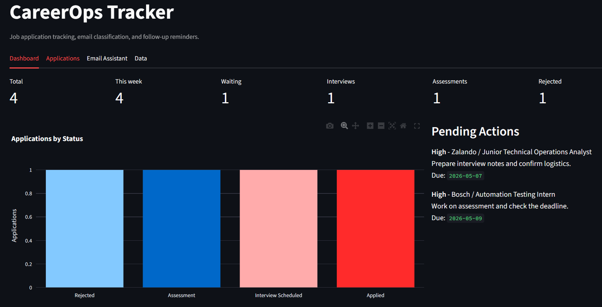
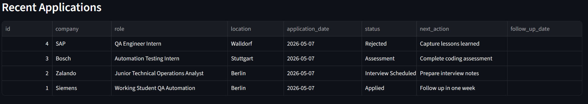
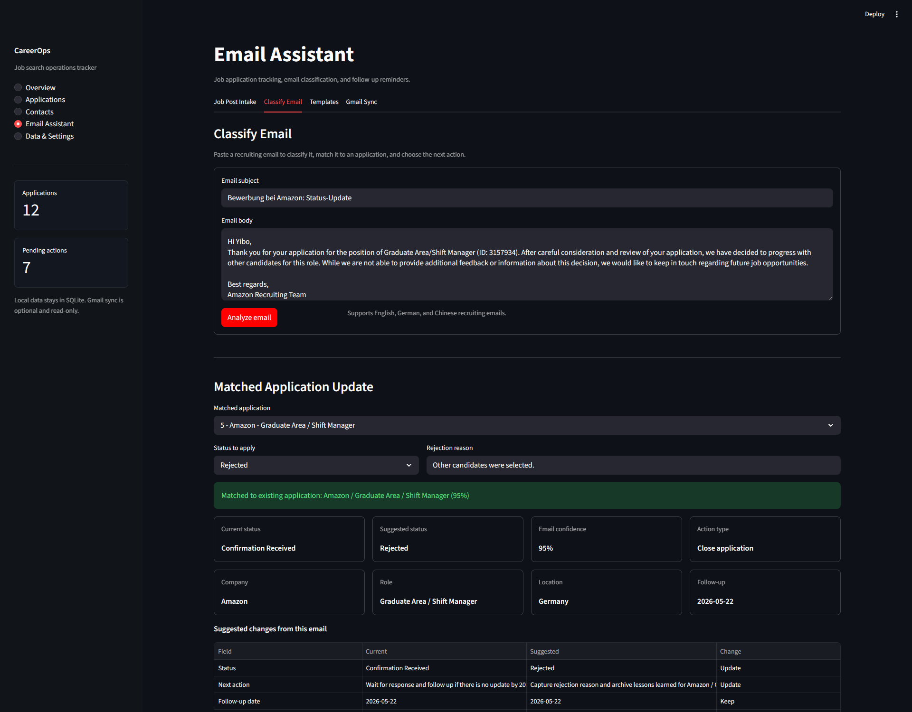
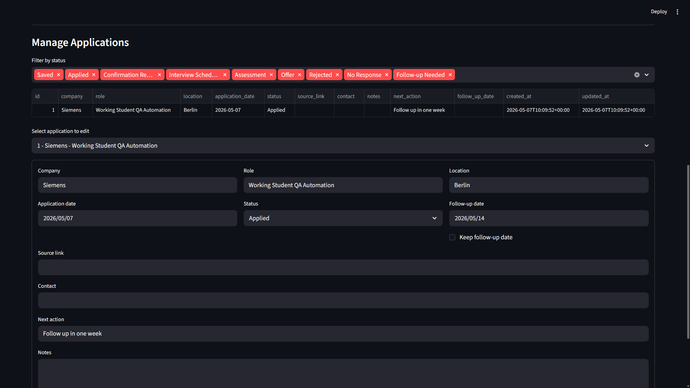

# CareerOps Tracker

[](https://github.com/zqybw98/careerops-tracker/actions/workflows/tests.yml)

[Live Demo](https://careerops-tracker.streamlit.app/)

A lightweight job application tracker and email classification assistant built with Python, Streamlit, and SQLite.

CareerOps Tracker helps job seekers structure applications, classify recruiting emails, and generate follow-up reminders from simple automation rules.

## Live Demo

Open the hosted Streamlit demo: [careerops-tracker.streamlit.app](https://careerops-tracker.streamlit.app/)

## Features

- Track companies, roles, locations, application dates, links, contacts, notes, rejection reasons, and status.
- Classify English, German, and Chinese recruiting emails as confirmation, recruiter reply, interview, assessment, rejection, follow-up, or other.
- Extract company, role, location, contact, source link, deadlines, interview dates, and rejection reasons from pasted recruiting emails.
- Draft Saved application records from pasted job descriptions or job URLs by extracting company, role, location, source link, contact, and deadline hints.
- Suggest application status updates from email classification results.
- Decide the recommended workflow action: update status, save a task, confirm a match, close a rejection, or create a new record.
- Generate an operation summary that explains the classification, target record, match confidence, status action, and next step.
- Gate status updates with confidence thresholds: high confidence can be applied, medium confidence requires review, and low confidence is blocked.
- Generate one-click next actions with priority, follow-up date, rationale, and suggested email template type.
- Rank the top existing application matches for recruiting emails with scores, confidence, and match reasons.
- Save manual correction feedback for email category, suggested status, and matched application; reuse it for similar future emails.
- Handle realistic recruiting-email edge cases such as forwarded messages, quoted replies, similar roles at the same company, mixed English/German text, multiple dates, and mismatch-based rejections.
- Optionally sync recent recruiting emails from Gmail with local read-only OAuth.
- Generate automated reminders for follow-ups, interviews, assessments, and stale applications.
- Generate editable follow-up, interview thank-you, recruiter outreach, and rejection acknowledgement emails.
- Keep an activity log for application creation, updates, imports, email-assistant actions, and cleanup.
- Apply versioned SQLite migrations through a lightweight `schema_version` table.
- Tune category keywords, parser patterns, matching thresholds, and reminder timing through JSON configuration files.
- View a Streamlit dashboard with application metrics and status charts.
- Edit key application fields directly from the dashboard recent-applications table.
- Search and filter applications by company or role, source/contact text, date range, status, and stale-only views.
- Use bulk application actions to archive records, mark no response, or set follow-up dates from the Applications page.
- View a contact-centric mini CRM layer for recruiters, hiring managers, referrals, last contact activity, follow-up status, channels, and linked applications.
- Export interview, assessment, offer follow-up, and follow-up dates as `.ics` calendar files or a copyable calendar text block.
- Analyze response rate by source, monthly application volume, role-type conversion, waiting days, stale pipeline risk, time-to-first-response, rejection reasons, follow-up outcomes, interview-to-offer funnel, and channel x role-type combinations.
- Navigate through a simplified sidebar workspace layout: Overview, Applications, Contacts, Email Assistant, and Data & Settings.
- Load demo applications to preview the dashboard immediately after setup.
- Import and export applications with CSV, including common English and Chinese headers.
- Re-import updated CSV files without creating duplicate application records.
- Keep Gmail integration optional and local-only.

## Screenshots

### Dashboard



### Application Records



### Email Classification Assistant



### Application Management



## Tech Stack

- Python
- Streamlit
- SQLite
- pandas
- plotly
- pytest
- ruff
- mypy
- pre-commit
- GitHub Actions

## Project Structure

```text
.
|-- app.py
|-- CHANGELOG.md
|-- requirements.txt
|-- requirements-dev.txt
|-- requirements-gmail.txt
|-- pyproject.toml
|-- .pre-commit-config.yaml
|-- config/
|   |-- email_classification_rules.json
|   |-- email_parser_rules.json
|   |-- job_post_rules.json
|   `-- reminder_rules.json
|-- migrations/
|   |-- 001_init.sql
|   |-- 002_add_rejection_reason.sql
|   `-- 003_add_email_feedback.sql
|-- .streamlit/
|   `-- config.toml
|-- .github/
|   `-- workflows/
|       |-- tests.yml
|       `-- release.yml
|-- src/
|   |-- __init__.py
|   |-- action_recommender.py
|   |-- analytics.py
|   |-- application_filters.py
|   |-- calendar_export.py
|   |-- config_loader.py
|   |-- contacts.py
|   |-- database.py
|   |-- csv_importer.py
|   |-- dashboard.py
|   |-- demo_data.py
|   |-- email_classifier.py
|   |-- email_feedback.py
|   |-- email_insights.py
|   |-- email_parser.py
|   |-- email_templates.py
|   |-- gmail_client.py
|   |-- job_post_parser.py
|   |-- models.py
|   |-- reminder_engine.py
|   `-- services/
|       |-- __init__.py
|       |-- email_workflow.py
|       `-- job_post_workflow.py
|-- tests/
|   |-- test_action_recommender.py
|   |-- test_analytics.py
|   |-- test_application_filters.py
|   |-- test_calendar_export.py
|   |-- test_config_loader.py
|   |-- test_contacts.py
|   |-- test_csv_importer.py
|   |-- test_database.py
|   |-- test_demo_data.py
|   |-- test_email_classifier.py
|   |-- test_email_edge_cases.py
|   |-- test_email_insights.py
|   |-- test_email_parser.py
|   |-- test_email_templates.py
|   |-- test_email_workflow_service.py
|   |-- test_gmail_client.py
|   |-- test_job_post_parser.py
|   |-- test_job_post_workflow.py
|   `-- test_reminder_engine.py
|-- samples/
|   |-- sample_applications.csv
|   `-- sample_emails.txt
`-- docs/
    |-- architecture.md
    |-- deployment.md
    `-- screenshots/
        |-- applications.png
        |-- dashboard.png
        |-- email-assistant.png
        `-- recent-applications.png
```

## Getting Started

Create and activate a virtual environment:

```bash
python -m venv .venv
```

On Windows PowerShell:

```bash
.venv\Scripts\Activate.ps1
```

Install dependencies:

```bash
pip install -r requirements.txt
```

For development checks:

```bash
pip install -r requirements-dev.txt
pre-commit install
```

Run the app:

```bash
streamlit run app.py
```

Run tests:

```bash
pytest
```

Run quality checks locally:

```bash
python -m ruff check .
python -m ruff format --check .
python -m mypy src
python -m pytest
```

## Deployment

The app is ready for Streamlit Community Cloud.

- Repository: `zqybw98/careerops-tracker`
- Branch: `main`
- Main file path: `app.py`
- Python version: `3.13`

Full deployment steps are in [`docs/deployment.md`](docs/deployment.md).

## Optional Gmail Sync

Gmail sync is an optional local-only module. The hosted demo does not connect to
your mailbox.

Install optional Gmail dependencies:

```bash
pip install -r requirements-gmail.txt
```

Then create a Google OAuth desktop credential, save it locally as
`credentials.json`, and open the Data tab. The first sync opens Google's OAuth
screen and stores a local `token.json` for future runs.

The app requests the read-only Gmail scope only and previews classified emails
before applying any suggested application updates. `credentials.json` and
`token.json` are ignored by Git.

## Example Workflow

1. Add a job application.
2. Paste a recruiting email into the Email Assistant.
3. Review the detected category, confidence score, extracted application context, suggested status, and smart next action.
4. Save correction feedback if the assistant chose the wrong category, status, or matched application.
5. Apply the next action or suggested status to a matched application, or create a new application from the email.
6. Generate a follow-up, thank-you, outreach, or acknowledgement email from the Templates tab.
7. Use the dashboard to monitor waiting applications, follow-up tasks, response rates, role conversion, and stale records.

For a quick demo, open the Data tab and click `Load sample applications`.

The CSV importer supports the default English columns and common Chinese headers
such as `公司名称`, `职位名称`, `申请日期`, `最新状态`, `拒绝原因`, and `备注/来源`.
When the same company, role, and application date already exist, CSV import
updates the existing record instead of adding a duplicate.

## Configurable Rules

Most rule-based behavior is stored in JSON under `config/` instead of being
hard-coded in Python modules:

- `email_classification_rules.json`: email categories, multilingual keywords, suggested statuses, next actions, follow-up intervals, and confidence settings.
- `email_parser_rules.json`: extraction regex patterns, common locations, intent keywords, rejection reason patterns, generic email domains, and match thresholds.
- `reminder_rules.json`: reminder priorities, messages, waiting-day thresholds, and default due-date behavior.

This makes future tuning easier: a new German rejection phrase, a stricter match
threshold, or a different follow-up interval can be changed in configuration and
covered by tests without rewriting the classifier logic.

## Email Categories

- Application Confirmation
- Recruiter Reply
- Interview Invitation
- Assessment / Coding Test
- Rejection
- Follow-up Needed
- Other

## Why This Project

This project demonstrates practical automation, structured information management, workflow analytics, and tooling. It is intentionally small enough to complete in one to two weeks while still showing real business value for QA, automation, technical operations, and tooling roles.

## Future Improvements

- Copy-to-clipboard action for generated email templates.
- Optional Gmail draft integration.
- Optional Google Calendar sync for interviews, assessments, and follow-up dates.
- Global activity feed across all application records.
- ML-based email classification.
- Weekly analytics export.
