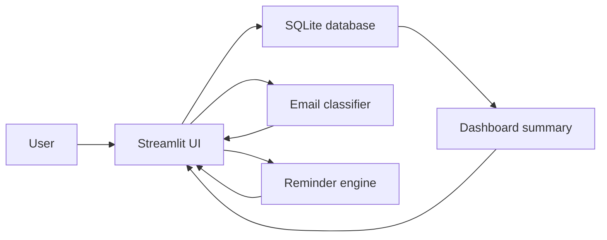

# Architecture

CareerOps Tracker is a local-first Streamlit application for managing job
applications, classifying recruiting emails, and generating follow-up actions.
The MVP is intentionally small: it uses SQLite for persistence, deterministic
rules for automation, and pytest for regression coverage.

## System Goals

- Keep the tool easy to run locally with no external service dependency.
- Structure application data so the job search pipeline can be reviewed quickly.
- Convert unstructured recruiting emails into actionable status updates.
- Make automation decisions explainable through matched keywords and rule output.
- Keep Gmail API integration optional so the core project remains lightweight.

## High-Level Flow



1. The user works through four sidebar workspaces: Overview, Applications,
   Assistant, and Data & Settings.
2. The user adds or imports application records in the Streamlit interface.
3. The app stores records in a local SQLite database under `data/`.
4. The dashboard reads application records and builds pipeline metrics.
5. The assistant classifies pasted or optionally synced Gmail recruiting emails with transparent rules.
6. Suggested email outcomes can update an existing application.
7. The reminder engine turns dates and statuses into pending actions.

## Components

| Component | Responsibility |
| --- | --- |
| `app.py` | Streamlit UI, tab routing, forms, import/export, and user interactions. |
| `src/analytics.py` | Builds decision-oriented metrics such as response rates, conversion, waiting days, weekly volume, and stale pipeline breakdowns. |
| `src/database.py` | SQLite connection management, schema creation, CRUD, CSV sync imports, duplicate cleanup, and activity logging. |
| `src/csv_importer.py` | Normalizes English and Chinese CSV headers, dates, and statuses before import. |
| `src/models.py` | Shared status options, application columns, and classification result shape. |
| `src/dashboard.py` | Aggregates applications into total, weekly, waiting, interview, assessment, and rejection metrics. |
| `src/email_classifier.py` | Rule-based recruiting email classification with confidence scores and suggested next actions. |
| `src/email_parser.py` | Extracts company, role, contact, and source-link hints from pasted email text and matches existing records. |
| `src/email_templates.py` | Generates rule-based follow-up, interview thank-you, recruiter outreach, and rejection acknowledgement emails. |
| `src/gmail_client.py` | Optional local Gmail API client that fetches read-only recruiting emails for preview classification. |
| `src/reminder_engine.py` | Generates follow-up, interview, assessment, stale-application, and saved-role reminders. |
| `src/demo_data.py` | Loads portfolio-friendly sample data from `samples/sample_applications.csv` without duplicates. |
| `tests/` | Regression tests for persistence, email rules, reminder rules, and demo data loading. |
| `pyproject.toml` | Central configuration for Ruff linting, Ruff formatting, and mypy type checking. |
| `.pre-commit-config.yaml` | Local hooks for lint auto-fix, formatting, and type checks before commits. |
| `.streamlit/config.toml` | Streamlit theme configuration used locally and in the hosted demo. |
| `.github/workflows/tests.yml` | Runs lint, format, type checks, and pytest on push and pull requests. |
| `docs/deployment.md` | Deployment checklist for publishing the app on Streamlit Community Cloud. |

## Data Model

The MVP stores application records and traceability events in SQLite.

### `applications`

| Field | Purpose |
| --- | --- |
| `id` | Auto-incrementing primary key. |
| `company` | Target company name. |
| `role` | Job title or internship title. |
| `location` | Role location, for example Berlin or Germany. |
| `application_date` | Date when the application was submitted or saved. |
| `status` | Pipeline state such as `Applied`, `Interview Scheduled`, `Assessment`, or `Rejected`. |
| `source_link` | Job post or company career page URL. |
| `contact` | Recruiter or contact email/name. |
| `notes` | Free-form application notes. |
| `rejection_reason` | Optional rejected-application context used for later review and analytics. |
| `next_action` | Human-readable next step. |
| `follow_up_date` | Date used by the reminder engine. |
| `created_at` | UTC timestamp for record creation. |
| `updated_at` | UTC timestamp for the latest update. |

### `application_events`

| Field | Purpose |
| --- | --- |
| `id` | Auto-incrementing event id. |
| `application_id` | Application record affected by the event. |
| `event_type` | Event name such as `application_created`, `status_changed`, or `application_deleted`. |
| `old_value` | Previous value or previous application summary. |
| `new_value` | New value or new application summary. |
| `source` | Actor/source such as `manual`, `csv_import`, `dashboard_inline_edit`, `email_assistant`, `gmail_sync`, `demo_data`, or `duplicate_cleanup`. |
| `created_at` | UTC timestamp when the event was recorded. |

The database is local and ignored by Git (`data/*.db`), so sample data and tests
can be shared without exposing personal job search records.

## Activity Logging

Every create, update, delete, CSV sync import, dashboard inline edit,
email-assistant update, Gmail sync action, demo-data load, and duplicate-cleanup
action can write an event to `application_events`.
The application management view shows the selected record's activity log, which
improves traceability and makes status changes auditable.

Rejected applications can also store a dedicated `rejection_reason`. This keeps
the main application table readable while preserving useful review context such
as no interview, after HR screen, position closed, experience mismatch, or
language/location mismatch. Changes to this field are recorded in the activity
log like other application updates.

## Application Statuses

Statuses are centralized in `src/models.py` to keep the UI, classifier, and
reminder rules aligned:

- `Saved`
- `Applied`
- `Confirmation Received`
- `Interview Scheduled`
- `Assessment`
- `Offer`
- `Rejected`
- `No Response`
- `Follow-up Needed`

Closed statuses are `Rejected` and `Offer`; the reminder engine skips these.

## Email Classification Design

The classifier is rule-based rather than ML-based. This is deliberate for the
MVP because recruiting email patterns are repetitive and explainability matters.

Each rule contains:

- a category, such as `Interview Invitation` or `Rejection`
- a suggested application status
- a suggested next action
- an optional follow-up interval
- keywords that explain why the rule matched

When an email is classified, the app returns the category, confidence score,
matched keywords, suggested status, and suggested next action. If no rule
matches, the email is classified as `Other` and routed to manual review.

The email assistant also extracts lightweight application context from pasted
email content. It looks for company names, role titles, sender/contact details,
and source links, then compares those hints against existing application records.
When a confident match is found, the matched application is pre-selected for
the user. If no match exists, the same extracted context can prefill a new
application record.

## Email Template Generation

The Templates tab generates editable, rule-based career email drafts from an
existing application record. Template selection can be suggested from application
status, for example rejected applications default toward acknowledgement emails
and interview records default toward thank-you emails. This keeps the workflow
lightweight while connecting reminders, statuses, and recruiting communication.

## Reminder Rules

The reminder engine converts structured application data into pending actions:

| Condition | Reminder |
| --- | --- |
| Follow-up date is due | High priority follow-up reminder. |
| Status is `Interview Scheduled` | Prepare interview notes and confirm logistics. |
| Status is `Assessment` | Work on assessment and check the deadline. |
| Application is open for 7+ days | Consider a polite follow-up. |
| Application is open for 14+ days | Consider follow-up or mark as no response. |
| Status is `Saved` | Decide whether to apply. |

This keeps the automation simple and deterministic while still providing
practical value for job search operations.

## Decision Analytics

The dashboard includes a decision-oriented analytics layer rather than only raw
record counts. `src/analytics.py` derives:

- response rate by inferred source, such as LinkedIn, StepStone, or career page
- interview/assessment conversion rate by inferred role type
- average active waiting days by company
- applications per calendar week
- stale pipeline breakdown for open applications
- saved-only versus submitted application volume

Sources and role types are inferred from lightweight rules so the analytics stay
transparent and testable. These metrics help answer operational questions such
as which channels are responding, where the pipeline is stale, and which role
types are converting into interviews or assessments.

## Import, Export, and Demo Data

CSV import/export makes the tool portable and easy to review. The expected CSV
columns are defined in `src/models.py` as `APPLICATION_COLUMNS`. The importer
also supports common Chinese headers such as `公司名称`, `职位名称`, `申请日期`,
`最新状态`, `拒绝原因`, and `备注/来源`, then normalizes them into the internal
application schema.

The Data tab also includes `Load sample applications`, which imports demo rows
from `samples/sample_applications.csv`. The loader checks company, role, and
application date to avoid creating duplicates when clicked multiple times.

CSV imports use a sync strategy instead of append-only inserts. If an imported
row matches an existing record by normalized company, role, and application
date, the app updates the existing record and merges notes. Otherwise it creates
a new record. A maintenance action can remove duplicate records that were
created by older append-only imports.

## Testing Strategy

The project uses pytest for fast regression tests:

- database tests verify application creation, updates, sync imports, duplicate cleanup, and activity events
- email classifier tests verify core recruiting email categories
- email template tests verify suggested template types and generated draft content
- reminder tests verify follow-up, interview, assessment, and closed-status logic
- demo data tests verify sample CSV loading and idempotent import behavior

GitHub Actions runs the same test suite on every push and pull request to
demonstrate basic CI discipline. The CI pipeline also runs `ruff check`,
`ruff format --check`, and `mypy src` so formatting, linting, type hints, and
regression tests are checked together.

Pre-commit hooks run the same local quality gates before commits:

- `ruff check --fix`
- `ruff format`
- `mypy src`

## Optional Gmail Module

Gmail integration is optional and isolated from the local workflow:

```text
Gmail API -> read-only email fetcher -> existing classifier -> preview -> user-applied update
```

The Gmail client uses `https://www.googleapis.com/auth/gmail.readonly`, stores
OAuth files locally as `credentials.json` and `token.json`, and does not modify
the mailbox. The core app continues to work with pasted email text when Gmail
dependencies or credentials are not configured, which keeps the hosted demo and
reviewer setup simple.

## Deployment Model

The hosted demo target is Streamlit Community Cloud. The repository is organized
so the platform can run the app directly from the root:

- entry point: `app.py`
- dependency file: `requirements.txt`
- visual configuration: `.streamlit/config.toml`
- recommended Python version: `3.13`

The deployed SQLite database is suitable for demo usage. Long-term production
usage would require a persistent hosted database, but that is intentionally out
of scope for this portfolio MVP.

## Design Decisions

- **Streamlit over Flask:** faster to build a useful dashboard and forms for a
  one-to-two-week portfolio project.
- **SQLite over hosted database:** no deployment dependency and enough structure
  for CRUD, filtering, and export workflows.
- **Rules over ML:** explainable output, predictable tests, and no training data
  requirement.
- **Local-first storage:** protects personal application data and keeps the demo
  reproducible.
- **Optional integrations:** external APIs can be added later without weakening
  the MVP.
