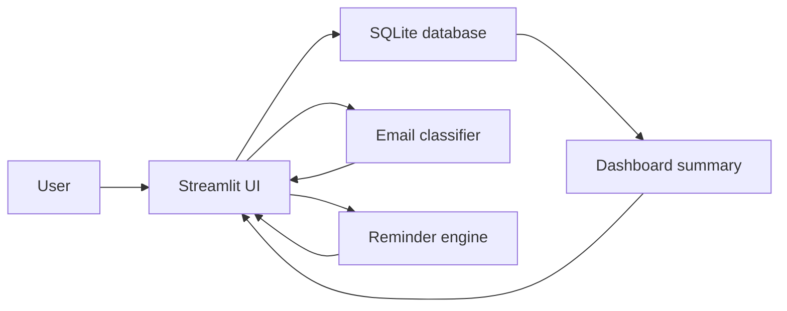

# Architecture

CareerOps Tracker is a local-first Streamlit application for managing job
applications, classifying recruiting emails, and generating follow-up actions.
The MVP is intentionally small: it uses SQLite for persistence, deterministic
rules for automation, and pytest for regression coverage.

## System Goals

- Keep the tool easy to run locally with no external service dependency.
- Structure application data so the job search pipeline can be reviewed quickly.
- Convert unstructured recruiting emails into actionable status updates.
- Make automation decisions explainable through matched keywords and rule output.
- Keep Gmail API integration optional so the core project remains lightweight.

## High-Level Flow



1. The user adds or imports application records in the Streamlit interface.
2. The app stores records in a local SQLite database under `data/`.
3. The dashboard reads application records and builds pipeline metrics.
4. The email assistant classifies pasted recruiting emails with transparent rules.
5. Suggested email outcomes can update an existing application.
6. The reminder engine turns dates and statuses into pending actions.

## Components

| Component | Responsibility |
| --- | --- |
| `app.py` | Streamlit UI, tab routing, forms, import/export, and user interactions. |
| `src/database.py` | SQLite connection management, schema creation, CRUD operations, CSV bulk insert support. |
| `src/models.py` | Shared status options, application columns, and classification result shape. |
| `src/dashboard.py` | Aggregates applications into total, weekly, waiting, interview, assessment, and rejection metrics. |
| `src/email_classifier.py` | Rule-based recruiting email classification with confidence scores and suggested next actions. |
| `src/reminder_engine.py` | Generates follow-up, interview, assessment, stale-application, and saved-role reminders. |
| `src/demo_data.py` | Loads portfolio-friendly sample data from `samples/sample_applications.csv` without duplicates. |
| `tests/` | Regression tests for persistence, email rules, reminder rules, and demo data loading. |
| `.github/workflows/tests.yml` | Runs pytest automatically on push and pull requests. |

## Data Model

The MVP stores one table, `applications`, in SQLite.

| Field | Purpose |
| --- | --- |
| `id` | Auto-incrementing primary key. |
| `company` | Target company name. |
| `role` | Job title or internship title. |
| `location` | Role location, for example Berlin or Germany. |
| `application_date` | Date when the application was submitted or saved. |
| `status` | Pipeline state such as `Applied`, `Interview Scheduled`, `Assessment`, or `Rejected`. |
| `source_link` | Job post or company career page URL. |
| `contact` | Recruiter or contact email/name. |
| `notes` | Free-form application notes. |
| `next_action` | Human-readable next step. |
| `follow_up_date` | Date used by the reminder engine. |
| `created_at` | UTC timestamp for record creation. |
| `updated_at` | UTC timestamp for the latest update. |

The database is local and ignored by Git (`data/*.db`), so sample data and tests
can be shared without exposing personal job search records.

## Application Statuses

Statuses are centralized in `src/models.py` to keep the UI, classifier, and
reminder rules aligned:

- `Saved`
- `Applied`
- `Confirmation Received`
- `Interview Scheduled`
- `Assessment`
- `Offer`
- `Rejected`
- `No Response`
- `Follow-up Needed`

Closed statuses are `Rejected` and `Offer`; the reminder engine skips these.

## Email Classification Design

The classifier is rule-based rather than ML-based. This is deliberate for the
MVP because recruiting email patterns are repetitive and explainability matters.

Each rule contains:

- a category, such as `Interview Invitation` or `Rejection`
- a suggested application status
- a suggested next action
- an optional follow-up interval
- keywords that explain why the rule matched

When an email is classified, the app returns the category, confidence score,
matched keywords, suggested status, and suggested next action. If no rule
matches, the email is classified as `Other` and routed to manual review.

## Reminder Rules

The reminder engine converts structured application data into pending actions:

| Condition | Reminder |
| --- | --- |
| Follow-up date is due | High priority follow-up reminder. |
| Status is `Interview Scheduled` | Prepare interview notes and confirm logistics. |
| Status is `Assessment` | Work on assessment and check the deadline. |
| Application is open for 7+ days | Consider a polite follow-up. |
| Application is open for 14+ days | Consider follow-up or mark as no response. |
| Status is `Saved` | Decide whether to apply. |

This keeps the automation simple and deterministic while still providing
practical value for job search operations.

## Import, Export, and Demo Data

CSV import/export makes the tool portable and easy to review. The expected CSV
columns are defined in `src/models.py` as `APPLICATION_COLUMNS`.

The Data tab also includes `Load sample applications`, which imports demo rows
from `samples/sample_applications.csv`. The loader checks company, role, and
application date to avoid creating duplicates when clicked multiple times.

## Testing Strategy

The project uses pytest for fast regression tests:

- database tests verify application creation and updates
- email classifier tests verify core recruiting email categories
- reminder tests verify follow-up, interview, assessment, and closed-status logic
- demo data tests verify sample CSV loading and idempotent import behavior

GitHub Actions runs the same test suite on every push and pull request to
demonstrate basic CI discipline.

## Optional Gmail Module

Gmail integration is intentionally outside the core MVP. A future Gmail module
should be optional and isolated from the local workflow:

```text
Gmail API -> email fetcher -> existing classifier -> suggested application update
```

The core app should continue to work with pasted email text even when Gmail
credentials are not configured. This keeps setup simple for reviewers and avoids
making personal mailbox access a requirement.

## Design Decisions

- **Streamlit over Flask:** faster to build a useful dashboard and forms for a
  one-to-two-week portfolio project.
- **SQLite over hosted database:** no deployment dependency and enough structure
  for CRUD, filtering, and export workflows.
- **Rules over ML:** explainable output, predictable tests, and no training data
  requirement.
- **Local-first storage:** protects personal application data and keeps the demo
  reproducible.
- **Optional integrations:** external APIs can be added later without weakening
  the MVP.
