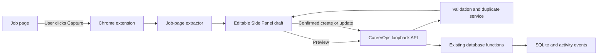

# CareerOps Capture Extension Design

## Goal

Reduce the daily application-recording workflow to:

```text
Open job page -> click extension -> review extracted draft -> save
```

The existing `job-application-autofill-extension` remains responsible for
browser interaction. CareerOps remains the source of truth for application
status rules, duplicate detection, activity events, and SQLite persistence.

## Current Context

CareerOps already provides:

- `create_application()` and `update_application()` for persistence and events;
- `apply_status_business_rules()` for normalized workflow behavior;
- `find_likely_duplicate_applications()` for company and role matching;
- a Windows launcher that starts Streamlit from the project virtual
  environment.

The extension already provides:

- Manifest V3;
- user-triggered `activeTab` and `scripting` access;
- generic and ATS-specific browser adapters;
- an existing Popup that owns the Autofill commands;
- local settings through `chrome.storage.local`;
- explicit no-auto-submit and no-file-upload boundaries.

The extension does not currently provide a Side Panel, loopback API client, or
job-page capture workflow.

## Approaches Considered

### 1. Local HTTP bridge using the Python standard library

CareerOps exposes a small authenticated HTTP service on
`127.0.0.1:8765`. The extension sends only a reviewed application draft.

**Advantages**

- no cloud service or external API;
- no new Python dependency;
- reuses CareerOps business rules directly;
- easy to test with temporary SQLite databases;
- immediate save result and duplicate feedback.

**Trade-off**

- one-time local pairing is required.

### 2. Flask or FastAPI bridge

This offers convenient routing and validation but adds dependencies and a
second application lifecycle to a Streamlit project.

**Decision:** Not selected for the MVP. The contract is too small to justify
the added dependency and setup work.

### 3. File-based import queue

The extension would export JSON and CareerOps would import the file later.

**Decision:** Not selected. Chrome cannot write arbitrary local files without
an additional download-and-import step, which preserves the current workflow
friction.

## Chosen Architecture



The bridge uses Python's standard-library HTTP server and binds only to
`127.0.0.1:8765`. It is disabled unless the local Windows launcher explicitly
enables it. Streamlit Cloud therefore does not expose or start this interface.

Chrome 142 and later gate loopback requests behind Local Network Access (LNA).
The first health request is therefore made by the visible Side Panel document,
not exclusively by the extension service worker. A worker may make later
requests only after the extension origin has already received permission.

## Repository Ownership

### `careerops-tracker`

Owns:

- loopback API and request authentication;
- payload validation and status normalization;
- duplicate preview and duplicate resolution;
- safe create/update orchestration;
- SQLite writes and activity events;
- local token generation and storage;
- Windows startup integration.

### `job-application-autofill-extension`

Owns:

- user-triggered page access;
- page extraction;
- the editable Side Panel;
- local API client and connection state;
- storage of the local pairing token;
- display of duplicate candidates and save results.

The extension must not copy CareerOps database rules. CareerOps must not contain
extension UI or page-specific browser extraction code.

## User Workflow

### One-time pairing

1. Start CareerOps locally.
2. Open the extension options page.
3. Enable the optional `http://127.0.0.1/*` permission.
4. In CareerOps `Tools`, open the local-only `Browser Capture pairing`
   section and explicitly reveal the generated token.
5. Copy the token into the extension options page. Before storing it, the
   extension restricts `chrome.storage.local` to trusted extension contexts.
6. On a normal job page, open the existing Popup and click
   `Capture current job`. That click records the exact target Tab ID and page
   URL in short-lived extension session state before opening a tab-specific
   Side Panel.
7. The visible Side Panel verifies that the recorded Tab still exists at the
   recorded URL, then issues the first `GET /api/v1/health` request. This
   request triggers Chrome's LNA permission prompt when permission is still in
   the `prompt` state.
8. After health succeeds, the Side Panel sends an authenticated
   `POST /api/v1/pair/confirm`. CareerOps records the requesting extension
   origin only after the bearer token has been validated.
9. The Side Panel reports connection, permission, and authentication states
   separately.

The API URL is fixed to `http://127.0.0.1:8765` in the MVP. It is not an
arbitrary user-editable remote URL.

The Bridge never exposes an anonymous endpoint that returns or generates the
token. In particular, `GET /pair -> token` is forbidden. Pairing requires the
user to copy the token from the local CareerOps UI and paste it into the
extension.

### Daily capture

1. Open a job page.
2. Click the extension icon to open the existing Popup.
3. Choose `Capture current job`; the Popup records the target `{tabId, url}`
   and opens the Side Panel for that exact Tab from the same explicit user
   gesture.
4. The Side Panel reads the recorded target Tab, verifies that its URL has not
   changed, and extracts Company, Role, Location, Application Date, Status,
   Source, and an optional note. It never substitutes whichever Tab happens to
   be active later.
5. Application Date defaults to the user's local date at the moment Capture is
   invoked.
6. The user corrects any field as needed.
7. The extension requests a duplicate preview.
8. If no likely duplicate exists, the user clicks `Save to CareerOps`.
9. If a likely duplicate exists, the user chooses:
   - `Use existing record`;
   - `Create anyway`;
   - `Cancel`.
10. The Side Panel displays the saved CareerOps ID and an `Open in CareerOps`
    action.

Saving is never automatic.

The capture target is stored in `chrome.storage.session` with its original Tab
ID, URL, and capture time. It contains no token or page content. Switching to a
different active Tab while the Side Panel opens does not change the target. If
the recorded Tab closes, its URL changes, or Chrome revokes `activeTab` before
extraction, the Side Panel does not request broader access or fall back to the
new active Tab; it asks the user to click the extension again.

## Extension UI

The existing popup remains intact for Autofill. It gains one command:

```text
Extension icon
  -> existing Popup
      -> Fill current page
      -> Show detected fields
      -> Capture current job
          -> open Side Panel
```

That user gesture opens a Side Panel. Programmatic Side Panel opening requires
Chrome 116 or later, so the extension declares that minimum version.

The extension does not enable `openPanelOnActionClick`. Doing so would replace
the current Popup entry point and regress Autofill. `chrome.sidePanel.open({
tabId })` is called only from the Popup's `Capture current job` click handler.
Before that call, the handler records the same Tab ID and URL in
`chrome.storage.session`. The Side Panel, once visible, validates and reads that
recorded target and performs the first loopback health request.

The Side Panel contains only:

```text
CareerOps Capture

Company
Role
Location
Application date
Status
Source
Notes

Duplicate result

[Refresh from page] [Save to CareerOps]
```

After success, the form collapses to:

```text
Application saved as #123

[Open in CareerOps] [Capture another]
```

The Side Panel maintains an `edited_fields` set. Only direct user input or
change events add a field name. Initial extraction, normalization, duplicate
preview responses, and `Refresh from page` do not mark fields as edited;
refreshing resets both the draft baseline and the set. Before a confirmed save,
the extension sends the unique field names in stable sorted order.

## Page Extraction

Extraction runs only after the user invokes the extension. It uses the
following precedence:

1. `JobPosting` JSON-LD;
2. known ATS adapter;
3. generic page metadata and DOM.

### Structured data

The extractor searches all `application/ld+json` blocks and handles both:

- a direct `JobPosting` object;
- a `@graph` containing a `JobPosting`.

It extracts:

- `title`;
- `hiringOrganization.name`;
- `jobLocation` or `applicantLocationRequirements`;
- `employmentType`;
- `description`;
- `datePosted`.

`JobPosting.datePosted` is the job publication date, not the user's application
date. It may be shown as read-only extraction evidence, but it is not sent as
`application_date` and never overrides that field. `application_date` defaults
to the user's local date when Capture is invoked and remains editable before
save.

### Generic fallback

The generic extractor uses:

- `h1`;
- document title;
- Open Graph title and site name;
- canonical/current URL;
- visible labels near Company and Location;
- the main page text only for bounded pattern matching.

The extractor does not send page text to CareerOps. Only the user-reviewed
fields are transmitted. Raw HTML, full page text, cookies, form values, CVs,
and attachments are never sent.

### ATS adapters

Capture-specific extractors live under a separate namespace from the current
form-field adapters:

```text
src/capture/extractors/
  jsonLd.js
  generic.js
  personio.js
  workday.js
```

The first implementation starts with JSON-LD and generic extraction.
Personio or Workday adapters are added only when manual fixtures demonstrate a
real accuracy gap.

## API Contract

All responses use:

```http
Content-Type: application/json; charset=utf-8
Cache-Control: no-store
```

Authenticated requests use:

```http
Authorization: Bearer <local-random-token>
X-CareerOps-API-Version: 1
```

Missing or unsupported `X-CareerOps-API-Version` values return `400` with
machine code `unsupported_api_version`. The Bridge never guesses or silently
falls back to another contract version.

All POST endpoints accept only `application/json` and enforce a 256 KiB
request-body limit before JSON parsing or database access.

### Health

```http
GET /api/v1/health
```

Authentication is not required.

```json
{
  "status": "ok",
  "service": "careerops-capture",
  "api_version": 1,
  "authentication": "bearer"
}
```

The health response contains no token, database path, user identifier, or
application data. For this endpoint only, the server may echo a syntactically
valid `chrome-extension://<id>` request origin in
`Access-Control-Allow-Origin`; it never uses `*`.

### Pair confirmation

```http
POST /api/v1/pair/confirm
```

This request requires the pasted bearer token. On the first successful pairing,
CareerOps records the exact `chrome-extension://<id>` Origin. If another
extension origin is already paired, the request is rejected until the user
rotates or resets pairing locally. No pairing response contains the token.

For the initial pair-confirmation preflight and response, the server may echo
the exact syntactically valid `chrome-extension://<id>` request origin without
recording it until bearer authentication succeeds. The CORS preflight permits
only the fixed API methods and headers, returns no application data, and does
not weaken authentication for the actual request.

### Preview

```http
POST /api/v1/applications/preview
```

Request:

```json
{
  "company": "Example GmbH",
  "role": "Junior Technical Support Engineer",
  "location": "Berlin",
  "application_date": "2026-07-25",
  "status": "Applied",
  "source_link": "https://example.com/jobs/123",
  "notes": "Captured from a reviewed job page."
}
```

Response:

```json
{
  "normalized": {
    "company": "Example GmbH",
    "role": "Junior Technical Support Engineer",
    "location": "Berlin",
    "application_date": "2026-07-25",
    "status": "Applied",
    "source_link": "https://example.com/jobs/123",
    "notes": "Captured from a reviewed job page.",
    "next_action": "Wait",
    "follow_up_date": ""
  },
  "duplicates": [
    {
      "application_id": 42,
      "company": "Example GmbH",
      "role": "Junior Technical Support Engineer",
      "score": 0.96,
      "reason": "company similarity 100%, position similarity 91%"
    }
  ]
}
```

### Create

```http
POST /api/v1/applications
```

The body contains the same reviewed fields plus:

```json
{
  "client_request_id": "6fbe432a-f4a7-4d93-94bd-9cd5885aa523",
  "duplicate_resolution": "none",
  "edited_fields": ["location", "notes"]
}
```

Allowed resolution values:

- `none`: create only when no likely duplicate exists;
- `create_anyway`: explicit user override after a duplicate warning;
- `use_existing`: update the selected existing record.

For `use_existing`, the confirmed request includes all reviewed fields, the
existing record ID, and the user's explicit field-edit intent:

```json
{
  "company": "Example GmbH",
  "role": "Junior Technical Support Engineer",
  "location": "Berlin",
  "application_date": "2026-07-25",
  "status": "Applied",
  "source_link": "https://example.com/jobs/123",
  "notes": "Captured from a reviewed job page.",
  "client_request_id": "6fbe432a-f4a7-4d93-94bd-9cd5885aa523",
  "duplicate_resolution": "use_existing",
  "existing_application_id": 42,
  "edited_fields": ["location", "notes"]
}
```

Success:

```json
{
  "result": "created",
  "application_id": 123,
  "replayed": false,
  "open_url": "http://localhost:8501/?workspace=Applications&application_id=123"
}
```

An existing-record update returns `"result": "updated"`.

### Open in CareerOps deep link

`open_url` is generated by the Bridge, never copied from page content. Its
origin is fixed to the local Streamlit UI and it may contain only:

```text
workspace=Applications
application_id=<positive integer>
```

At the start of a Streamlit run, before the Sidebar widget is instantiated,
`consume_application_deep_link() -> int | None` reads those two parameters.
It accepts only the exact `Applications` workspace and a positive integer
application ID. A valid existing record requests the Applications workspace
and sets `applications_pending_detail_id`, so the existing Details dialog
opens. The helper then clears the query parameters so a later rerun cannot
reopen the dialog.

A non-numeric, non-positive, missing, or deleted application ID safely opens
the Applications workspace without a Details dialog. All other query
parameters and any value resembling another URL or file path are ignored; the
deep link cannot navigate Streamlit to an arbitrary destination.

### Idempotency

Every confirmed create or update requires a UUID v4 `client_request_id`. The
extension creates it once for a new explicit capture and retains it across
rerenders, timeouts, and retries. A retry must reuse the same ID and the same
immutable save payload. After the first save attempt, the user may retry that
payload or cancel and begin a new capture; editing it into a different request
requires a new explicit capture and a new ID.

CareerOps stores processed requests in a small SQLite table created by the next
versioned migration:

```text
capture_requests
  client_request_id TEXT PRIMARY KEY
  payload_sha256 TEXT NOT NULL
  application_id INTEGER NOT NULL
  result TEXT NOT NULL
  created_at TEXT NOT NULL
```

The hash is computed from canonical normalized application fields, duplicate
resolution, any existing application ID, and the deduplicated, stably sorted
`edited_fields` array. It excludes the bearer token and `client_request_id`;
the full request payload is not retained.

`capture_requests` is an internal operational table and remains outside the
private-data export allowlist. Existing private export behavior is unchanged;
an integration test confirms that an export still succeeds when this internal
table exists.

The application write, activity event, and idempotency record are committed in
one short SQLite transaction:

- same ID and same canonical payload: return the original application ID and
  result with `"replayed": true`; do not append another note or event;
- same ID and different payload: return `409` with
  `idempotency_conflict`; do not write;
- new ID: perform exactly one confirmed create or update.

This is the authoritative double-submit protection. Disabling the Save button
is only a UI safeguard.

### Transaction boundary

The existing public `create_application()` and `update_application()` functions
open their own SQLite connections and commit their own transactions. The Bridge
therefore must not call either public function from inside a second transaction
and claim atomicity.

The implementation introduces connection-aware internal functions:

```python
_create_application_in_transaction(connection, payload, source)
_update_application_in_transaction(
    connection,
    application_id,
    payload,
    source,
)
```

The existing public functions remain backward-compatible wrappers that open a
connection, call the corresponding internal function, commit, and return their
existing result. The Capture Service opens one connection and uses one explicit
short transaction for:

```text
BEGIN
  application create or update
  application activity event
  capture_requests insert
COMMIT
```

Any failure rolls back all three effects. A response is not reported as
successful until the transaction commits.

## Validation

The API accepts only these input fields:

- `company`;
- `role`;
- `location`;
- `application_date`;
- `status`;
- `source_link`;
- `notes`;
- `client_request_id` for confirmed create/update requests;
- duplicate-resolution fields;
- `edited_fields` for confirmed create/update requests.

Rules:

- Company and Role are required after trimming.
- Application Date must use ISO `YYYY-MM-DD`.
- An empty Status defaults to `Applied`.
- A non-empty Status must be an exact CareerOps option or a recognized alias;
  an unknown value is rejected instead of silently becoming `Applied`.
- Confirmed create/update requests require a valid UUID v4
  `client_request_id`; preview requests do not persist one.
- `edited_fields` is optional for preview and must be an array of strings when
  present on a confirmed request.
- Its allowed values are `company`, `role`, `location`, `application_date`,
  `status`, `source_link`, and `notes`; an unknown value returns `422`.
- The server deduplicates and stably sorts `edited_fields` before merge
  decisions and idempotency hashing.
- `none` and `create_anyway` validate and hash `edited_fields` but do not use it
  to change create semantics. `use_existing` must use it for merge decisions.
- Source must be an `http` or `https` URL.
- Company is limited to 200 characters.
- Role is limited to 300 characters.
- Location is limited to 300 characters.
- Source is limited to 2,000 characters.
- Notes are limited to 4,000 characters.
- Unknown fields are rejected to expose contract drift.

The server then calls `apply_status_business_rules()` before persistence.
Writes use source `chrome_capture` in the activity log.

## Duplicate Handling

The preview reuses `find_likely_duplicate_applications()` and returns at most
three candidates.

The server additionally treats an exact normalized Company + Role + Source
combination as a blocking duplicate. This protects separate capture requests
that refer to the same application; `client_request_id` separately protects
retries of one confirmed request.

When `use_existing` is selected:

- existing non-empty Company and Role are protected and may be overwritten
  only when the corresponding field name appears in `edited_fields`; otherwise
  an extracted value may only fill a blank field;
- unedited Location, Source, and Application Date values may only fill blank
  existing fields; explicitly edited values may replace them;
- capture Notes are appended by a fixed server rule and are never substituted,
  even when `notes` appears in `edited_fields`; the client cannot request
  replace semantics;
- when `status` is absent from `edited_fields`, preserve the existing non-empty
  Status; only a blank existing Status may be filled from the normalized
  incoming value;
- when `status` appears in `edited_fields`, use the user's explicitly selected,
  validated incoming Status and then run `apply_status_business_rules()`;
- an explicit Rejected edit therefore clears Follow-up Date and sets Next
  Action to `No action`;
- all actual field changes are recorded by the connection-aware update helper
  in the same transaction.

An omitted or empty `edited_fields` array never authorizes overwriting a
protected non-empty field.

## Authentication and Local Storage

On first Bridge start, CareerOps generates a 32-byte random token with
`secrets.token_urlsafe()` and stores it under the ignored local `data/`
directory. File permissions are restricted to the current OS user on a
best-effort basis. Failure to apply that restriction produces a local warning,
not a silent claim of protection. The token is never committed, printed in
routine logs, added to `.env`, or included in private-data exports.

CareerOps `Tools` can explicitly reveal and copy the token only in a local run.
No remote request can generate, read, or reveal it. The user may rotate the
token locally; rotation atomically replaces it, immediately invalidates the old
value, clears the paired extension origin, and requires re-pairing.

The extension stores the token in `chrome.storage.local` only after applying:

```javascript
await chrome.storage.local.setAccessLevel({
  accessLevel: "TRUSTED_CONTEXTS"
});
```

The access restriction is initialized before any connection setting is read or
written. Only the Popup, Side Panel, Options page, and service worker may read
the token. Content scripts and page-injected extraction functions cannot read
it. The token is never passed to an extractor with
`chrome.runtime.sendMessage()` or `chrome.scripting.executeScript()`, and is
never placed in the DOM, URL, logs, screenshots, or error text. Existing
Autofill continues to receive only the profile/settings values explicitly
passed by the trusted Popup.

The extension sends the token only to the fixed loopback URL. Token comparisons
use `secrets.compare_digest()`. Missing and mismatched tokens receive the same
generic `401` body, and the API never echoes the token.

The API never returns `Access-Control-Allow-Origin: *`. It accepts write
requests only when the `Origin` header exactly matches the paired
`chrome-extension://<id>` origin and the bearer token is valid. The
authenticated pair confirmation records that origin without adding a broad
website allowlist.

## Browser Permissions

The extension retains:

```json
{
  "permissions": ["storage", "activeTab", "scripting", "sidePanel"],
  "optional_host_permissions": ["http://127.0.0.1/*"]
}
```

`activeTab` continues to grant temporary page access only after an explicit
user gesture. The optional loopback permission is requested only when Capture
is enabled. The extension does not request `<all_urls>`.

Chrome match patterns cannot constrain this permission to port 8765:
`http://127.0.0.1/*` covers the loopback host on any port. The runtime boundary
is therefore enforced by a single production API-client constant:

```javascript
const CAREEROPS_API_ORIGIN = "http://127.0.0.1:8765";
```

The production client exposes no user-editable base URL and cannot construct a
request for another origin or port. All loopback fetches originate from an
extension page, not from a content script, and no URL comes from page content.

### Local Network Access

Chrome 142 introduced an LNA prompt for requests to local and loopback
destinations. Service workers cannot independently trigger the first prompt, so
the connection sequence is owned by the visible Side Panel:

1. Query `loopback-network` where supported, falling back to the
   `local-network-access` alias used by Chrome 142.
2. If the state is `prompt`, explain the prompt and issue the first `/health`
   fetch from the visible Side Panel after the user chooses Connect.
3. If the state is `denied`, explain how to restore the permission and do not
   label CareerOps as merely offline.
4. If permission is granted, run `/health` with a five-second timeout.
5. Report timeout, Bridge offline/network failure, and authenticated `401`
   pairing failure as distinct states.

If the Permissions API itself is unavailable, the Side Panel performs the
visible health request and reports a conservative
`Local access blocked or Bridge unavailable` state rather than incorrectly
claiming one cause. Chrome 142 and the latest supported Chrome version are both
included in manual verification.

## Startup and Lifecycle

`start.bat` remains the daily entry point.

The minimal implementation adds a small `src.capture_api` module. `start.bat`
enables the bridge for local runs, and `app.py` calls
`ensure_capture_bridge_started()` before rendering Streamlit.

Streamlit reruns `app.py`, so Bridge lifecycle state cannot live in
`st.session_state` or in a page-local object. `src.capture_api` owns a
process-level Bridge reference and Lock. `ensure_capture_bridge_started()` is
thread-safe and idempotent:

- when this process already owns a running Bridge, return that instance;
- when another process on port 8765 answers with the valid CareerOps health
  identity, return `external_bridge_detected` without adopting that server,
  revealing or rotating this process's token, or changing this process's
  singleton state;
- when another application owns the port, return `port_conflict`;
- both warning states keep Streamlit usable; `external_bridge_detected`
  instructs the user to close the other CareerOps process or use its UI, while
  `port_conflict` identifies that the conflicting application must be closed;
- concurrent calls may start at most one daemon server thread.

Requirements:

- bind only `127.0.0.1`;
- do not start on Streamlit Cloud;
- do not start during imports or tests unless explicitly requested;
- do not start for a normal `streamlit run app.py` unless an explicit
  environment variable or `start.bat` enables it;
- only `_BRIDGE_SERVER` owned by the current Python process may be reused;
- if another CareerOps process owns port 8765, report
  `external_bridge_detected` and do not adopt it;
- if another application owns the port, report `port_conflict`;
- never reveal or rotate the current process's token in either external-owner
  state, and keep the Streamlit application usable;
- stop with the Streamlit Python process.

The manual command remains valid for Streamlit alone. Capture requires
`start.bat` or an explicit environment opt-in.

The hosted Streamlit demo is not a Capture API endpoint. The extension connects
only to the explicitly configured `127.0.0.1` Bridge and never falls back to
`careerops-tracker.streamlit.app` or any other remote URL.

## Error Handling

The Capture Service exposes typed failures so the HTTP layer never parses
exception text:

| Service exception | HTTP behavior |
| --- | --- |
| `CaptureValidationError` | `422` field-level validation error |
| `CaptureConflictError(code="duplicate_conflict")` | `409 duplicate_conflict` |
| `CaptureConflictError(code="idempotency_conflict")` | `409 idempotency_conflict` |
| `CaptureNotFoundError` | `404 existing_application_not_found` |
| `CaptureDatabaseBusyError` | `503 database_busy` |

| Condition | HTTP/UI behavior |
| --- | --- |
| Local network permission required | Visible Side Panel triggers the first `/health` request and explains Chrome's prompt |
| Local network permission denied | Explain how to restore permission; do not report the Bridge as merely offline |
| CareerOps is not running | Side Panel shows `CareerOps is not running` |
| Request timeout | Show timeout and allow a safe retry with the same `client_request_id` and payload |
| Token missing or invalid | `401`; Side Panel links to pairing instructions |
| Invalid JSON | `400`; no database write |
| API version missing or unsupported | `400` `unsupported_api_version`; no database write |
| Unsupported content type | `415`; require `application/json` |
| Request body too large | `413`; reject before parsing or database access |
| Invalid field or date | `422`; field-level message |
| Duplicate without resolution | `409` `duplicate_conflict`; return duplicate candidates |
| Reused ID with different payload | `409` `idempotency_conflict`; no database write |
| Missing existing ID | `404`; refresh duplicate preview |
| SQLite busy/unavailable | `503`; offer retry, never claim success |
| Unexpected server error | `500`; generic message, no stack trace |
| Restricted Chrome page | Explain that capture is unavailable on this page |
| Page navigation revoked access | Ask the user to click the extension again |

The Save button is disabled while a request is in progress. It is enabled again
only after a response or timeout.

## Privacy and Safety Boundaries

The MVP must:

- remain local-only;
- bind the API to `127.0.0.1`;
- require an explicit user gesture before page extraction;
- require review and confirmation before every create or update;
- never auto-submit an application;
- never access Gmail;
- never call cloud AI or third-party services;
- never upload CVs or attachments;
- never transmit cookies, credentials, form values, raw HTML, or full page
  text;
- never expose arbitrary proxy or fetch endpoints;
- never store the token in Git, logs, screenshots, or sample data;
- never expose the token to content scripts or page extraction code;
- never use the hosted Streamlit demo as a Capture fallback;
- never modify the private-data synchronization workflow.

## Testing Strategy

### CareerOps

Unit tests use a temporary database and cover:

- health response;
- health response excludes tokens, paths, user data, and application data;
- authentication success and failure;
- authenticated first pairing records one exact extension origin;
- another extension origin is rejected until local pairing reset or rotation;
- token rotation immediately invalidates the old token and clears the paired
  origin;
- request-size and content-type rejection;
- field validation and status normalization;
- `edited_fields` validation, unknown-field rejection, deduplication, and
  stable ordering;
- `datePosted` never becoming `application_date`;
- preview with no duplicate and likely duplicates;
- blocked duplicate creation;
- explicit create-anyway;
- safe existing-record update, including protected non-empty Company and Role
  fields and fill-only behavior for unedited extracted fields;
- existing Interview plus unedited incoming Applied preserving Interview;
- existing Rejected plus unedited incoming Applied preserving Rejected;
- an explicitly edited Status using the validated selected value;
- an explicit Rejected edit clearing Follow-up Date and setting `No action`;
- same-ID/same-payload idempotent replay;
- same-ID/different-payload conflict;
- `edited_fields` participation in the idempotency hash;
- atomic application, event, and idempotency writes, including rollback when
  any one of the three steps fails;
- backward-compatible public application create/update wrappers;
- Rejected business rules;
- activity source `chrome_capture`;
- database-lock failure;
- simultaneous Streamlit-style reads and Bridge writes against one temporary
  database;
- two concurrent captures without corruption;
- completed Bridge writes becoming visible to a subsequent application-list
  read;
- private-data export succeeding while excluding `capture_requests`;
- localhost-only binding configuration;
- disabled-by-default startup;
- repeated and concurrent `ensure_capture_bridge_started()` calls creating at
  most one Bridge thread;
- process-owned singleton reuse;
- externally owned CareerOps Bridge detection without adoption;
- unrelated port-owner `port_conflict` warning behavior;
- valid application deep link opening Details once;
- non-numeric and deleted application IDs falling back safely;
- consumed query parameters not reopening Details on rerun;
- query parameters being unable to select another URL or file.

The concurrency integration test uses separate connections to one temporary
SQLite database, short write transactions, and a finite five-second busy
timeout. A lock that outlives the timeout must return `503`, not `500`.

### Extension

Plain JavaScript tests or fake-DOM smoke tests cover:

- direct and `@graph` JSON-LD extraction;
- generic title/company/location fallback;
- editable draft preservation;
- exact capture-target Tab ID and URL preservation across active-Tab switches;
- closed or navigated capture targets requiring a new explicit click instead
  of falling back to the current Tab;
- direct user edits producing a unique, stably ordered `edited_fields` array
  while extraction and refresh do not;
- no request before user confirmation;
- exact request payload;
- API client requests being constructible only for
  `http://127.0.0.1:8765`, never another origin or port;
- token stored in `chrome.storage.local` with `TRUSTED_CONTEXTS` access only;
- extraction scripts never receiving or reading the pairing token;
- existing Popup Autofill still working after the storage access restriction;
- duplicate warning choices;
- stable UUID v4 across timeout retries and rerenders;
- disabled Save button during an in-flight request;
- LNA prompt, denied, offline, timeout, unsupported API version, unauthorized,
  forbidden, not-found, duplicate, oversized, unsupported-media, validation,
  server-error, busy, and success states;
- use of `textContent` rather than unsafe `innerHTML`.

### Manual verification

Use synthetic job pages for:

- JSON-LD;
- generic company career page;
- Personio;
- Workday;
- missing Company or Location;
- existing duplicate;
- CareerOps stopped;
- LNA not yet granted and explicitly denied;
- invalid/rotated token;
- repeated Save clicks;
- response loss followed by retry with the same request ID;
- hosted demo unavailable as a connection target.

No real application or personal profile data is committed in fixtures or
screenshots.

## Rollout Plan

Implementation should remain split by repository:

1. CareerOps bridge, validation, duplicate orchestration, tests, and local
   startup.
2. Extension extraction core and local API client with fake-DOM tests.
3. Side Panel and pairing UI.
4. Manual synthetic-page verification.
5. Documentation and screenshots using synthetic data only.

Each repository receives its own reviewable commits. Neither repository is
pushed until its local checks and manual gate pass.

## Non-Goals

- automatic form submission;
- automatic save after autofill;
- background page monitoring;
- Gmail integration;
- cloud or LAN access;
- LLM-based extraction;
- CV or attachment handling;
- broad host permissions;
- automatic duplicate deletion;
- bidirectional synchronization with the extension's legacy local dashboard;
- using the hosted Streamlit demo as a Capture API or fallback;
- mobile or multi-user support.

## Acceptance Criteria

The design is implemented when:

1. The existing Autofill workflow still works.
2. A user can capture a synthetic job page in three steps: click, review,
   save.
3. Company, Role, Location, Date, Status, and Source are editable before save.
4. A successful save appears immediately in CareerOps Applications.
5. Likely duplicates are shown before any write.
6. Repeated clicks cannot silently create an exact duplicate.
7. CareerOps offline and authentication errors are clear and recoverable.
8. The extension has no `<all_urls>` permission and performs no cloud request.
9. Existing SQLite data and private-data sync behavior remain unchanged.
10. Tracker tests, extension syntax checks, fake-DOM smoke tests, and manual
    synthetic-page checks pass.
11. The first visible Side Panel loopback request can trigger Chrome's LNA
    prompt, and denied permission is distinguishable from an offline Bridge.
12. The pairing token is inaccessible to content scripts and page extraction
    code.
13. Retrying the same `client_request_id` and payload cannot create a second
    application or duplicate activity event.
14. `JobPosting.datePosted` never overrides `application_date`.
15. The extension never falls back to the hosted Streamlit demo.
16. A temporary-database integration test confirms simultaneous
    Streamlit-style reads and Bridge writes without data corruption, with lock
    timeout reported as `503`.
17. Existing-record updates overwrite protected non-empty fields only when
    those fields are explicitly listed in `edited_fields`.
18. `open_url` opens an existing captured Application's Details once; invalid
    or deleted IDs safely fall back to Applications and cannot navigate to
    another URL or file.
19. A Bridge owned by another process is reported as
    `external_bridge_detected` and is never adopted by the current process.
20. Missing or unsupported API versions return
    `400 unsupported_api_version`, and all documented API error classes remain
    machine-readable to the Extension.

## References

- [Chrome `activeTab` permission](https://developer.chrome.com/docs/extensions/develop/concepts/activeTab)
- [Chrome `scripting` API](https://developer.chrome.com/docs/extensions/reference/api/scripting)
- [Chrome Side Panel API](https://developer.chrome.com/docs/extensions/reference/api/sidePanel)
- [Chrome cross-origin requests](https://developer.chrome.com/docs/extensions/develop/concepts/network-requests)
- [Chrome match patterns](https://developer.chrome.com/docs/extensions/develop/concepts/match-patterns)
- [Chrome Local Network Access](https://developer.chrome.com/blog/local-network-access)
- [Chrome storage access levels](https://developer.chrome.com/docs/extensions/reference/api/storage)
- [Chrome 145 LNA permission split](https://developer.chrome.com/release-notes/145)
